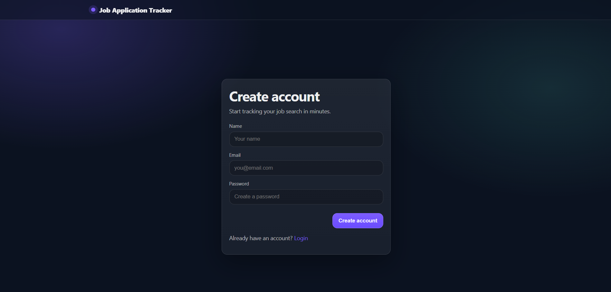
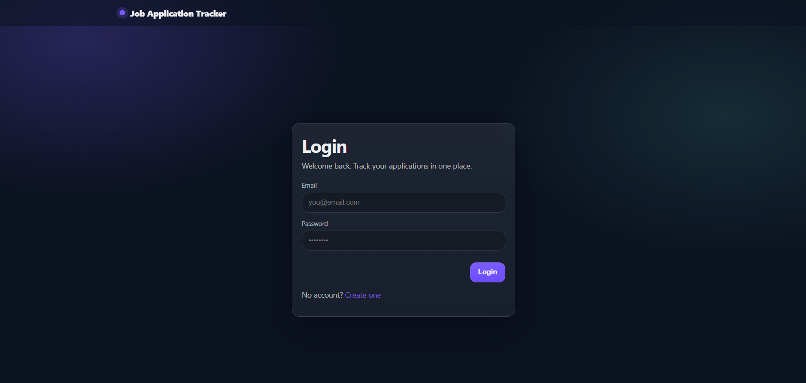
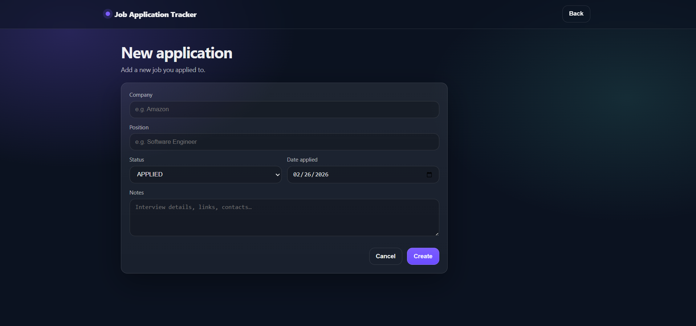
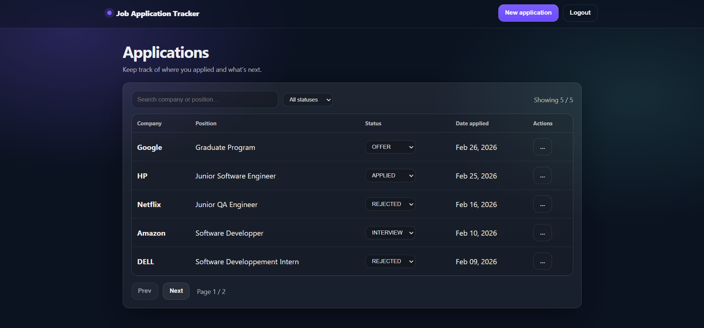

# Job Application Tracker – Secure Full-Stack Web Application

A secure, production-ready full-stack web application to manage and track job applications throughout the recruitment process.

The project demonstrates real-world software engineering practices including:
- JWT-based authentication & ownership enforcement
- Clean layered backend architecture
- Modern frontend with loading states & optimistic updates
- CI/CD pipeline
- Docker containerization
- Cloud deployment with managed PostgreSQL

---

## 🔗 Live Application:
### 🌍 Frontend:
https://job-application-tracker-two-puce.vercel.app
### 🔌 Backend API:
https://job-application-tracker-rat3.onrender.com
> ⚠️ Deployed on Render free tier — the service may take a few seconds to wake up after inactivity.

---

## 🖼️ Application Preview
<p align="center"><strong>Authentication</strong></p>
<p align="center">
  
  
</p>
<p align="center"><strong>Application Management</strong></p>
<p align="center">
  
  
</p>

---

## 🏗 Architecture Overview

The project follows a clean separation of concerns:

React SPA → Spring Boot REST API → Service Layer → JPA Repository → PostgreSQL

### Backend
- Layered architecture (Controller → Service → Repository)
- JWT authentication
- Ownership-based authorization (per-user data isolation)
- Global exception handling
- Profile-based configuration (dev / test / prod)
- Actuator health monitoring

### Frontend
- Secure auth flow (login/register)
- Protected routes
- Global auth state management
- Optimistic UI updates
- Skeleton loaders & loading states
- Toast notifications
- Production-ready build configuration

---

## 🚀 Features

### Job Application Management
- Full CRUD operations
- Pagination & sorting
- Filtering support
- Proper HTTP status codes
- Structured error handling
- Optimistic updates (instant UI feedback)

### Authentication & Security
- Authentication (JWT-based)
- User registration & login
- Ownership rules (users can only access their own data)
- Global auth handling on frontend
- CORS properly configured
- Environment-variable driven secrets

### Quality & Engineering practices
- Integration tests (MockMvc)
- Profile-based testing configuration (H2)
- GitHub Actions CI (runs tests on push)
- Docker multi-stage build
- Production config separation

### Deployment
- Dockerized backend
- Managed PostgreSQL database
- Public HTTPS deployment
- Health endpoint monitoring

---

## 🛠 Tech Stack
### Backend
- **Java 21**
- **Spring Boot**
- **Spring Web**
- **Spring Data JPA**
- **Spring Security (JWT)**
- **PostgreSQL**
- **H2 (tests)**
- **Docker**
- **Springdoc OpenAPI (Swagger UI)**
- **Spring Boot Actuator**
- **JUnit 5 & MockMvc**
- **Maven**

### Frontend
- **React (Vite)**
- **JavaScript (ES6+)**
- **React Router**
- **Axios**
- **JWT-based Authentication**
- **CSS**
---


## 📌 Domain Model

### JobApplication Entity
- Company
- Position
- Status (`APPLIED`, `INTERVIEW`, `OFFER`, `REJECTED`)
- Date applied
- Notes
- Owner (User relationship)

### User
- Email
- Encrypted password
- Role

---

## 🔐 Authentication Example
### Register
```bash
POST /api/auth/register
```
```json
{
  "email": "user@example.com",
  "password": "Password123!",
  "displayName": "User Name"
}
```
### Login
```bash
POST /api/auth/login
```
Returns a JWT token to be used in:
```makefile
Authorization: Bearer <token>
```
All `/api/applications/**` endpoints require authentication.
Users can only access their own data.

---

## 📡 API Endpoints

Base path: `/api/applications`

| Method | Endpoint                        | Description                   |
|--------|---------------------------------|-------------------------------|
| POST   | `/api/applications`             | Create a new job application  |
| GET    | `/api/applications`             | List applications (Paginated) |
| GET    | `/api/applications/{id}`        | Get application by ID         |
| PUT    | `/api/applications/{id}`        | Full update                   |
| PATCH  | `/api/applications/{id}/status` | Update application status     |
| DELETE | `/api/applications/{id}`        | Delete an application         |


Pagination example:
```bash
GET /api/applications?page=0&size=10&sort=dateApplied,desc
```
---

## ❤️ Health Check
```bash
GET /actuator/health
```
Used for production monitoring.

---

## ⚙️ Profiles
- `dev` → Swagger enabled
- `test` → H2 in-memory DB
- `prod` → PostgreSQL + environment variables
Required production environment variables:
- `SPRING_PROFILES_ACTIVE=prod`
- `SPRING_DATASOURCE_URL`
- `SPRING_DATASOURCE_USERNAME`
- `SPRING_DATASOURCE_PASSWORD`
- `JWT_SECRET`

---

## 🐳 Docker
Build image:
```bash
docker build -t job-tracker .
```

Run container:
```bash
docker run -p 8080:8080 job-tracker
```

---

## 🧪 Tests

Integration tests validate:
- Authentication flows
- Ownership enforcement
- CRUD operations
- Validation errors
- Pagination behavior

Run tests with:
```bash
mvn test
```
CI automatically runs on push via GitHub Actions.

---

## 🎯 Project Goals

This project demonstrates:
- Production-ready REST API design
- Secure authentication & authorization
- Clean architecture & separation of concerns
- Real frontend-backend integration
- CI/CD pipeline setup
- Practical DevOps awareness
- Cloud deployment experience
- Docker containerization

---
## 📚 Purpose

This project was developed as part of a **gap year personal initiative** after a MIAGE Bachelor degree to:
* Strengthen full-stack development skills
* Apply clean architecture principles
* Practice REST API design
* Gain hands-on experience with testing and QA-oriented development

## 🔜 Future Improvements
* Admin role
* Statistics endpoint (dashboard metrics)
* Monitoring & logging improvements

## 👩‍💻 Author
**Mariam Fathallah**
MIAGE Graduate - Software Engineering & QA oriented